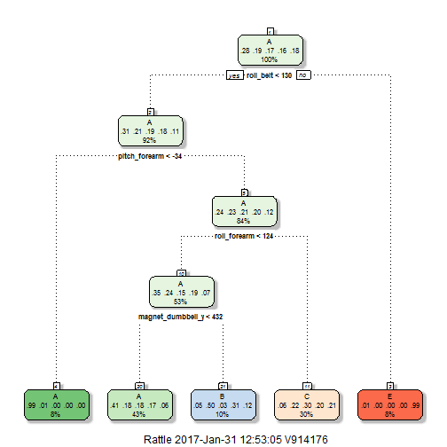

## Introduction

### Background

Using devices such as Jawbone Up, Nike FuelBand, and Fitbit it is now possible to collect a large amount of data about personal activity relatively inexpensively. These type of devices are part of the quantified self movement - a group of enthusiasts who take measurements about themselves regularly to improve their health, to find patterns in their behavior, or because they are tech geeks. One thing that people regularly do is quantify how much of a particular activity they do, but they rarely quantify how well they do it. In this project, your goal will be to use data from accelerometers on the belt, forearm, arm, and dumbell of 6 participants. They were asked to perform barbell lifts correctly and incorrectly in 5 different ways. More information is available from the website here: http://groupware.les.inf.puc-rio.br/har (see the section on the Weight Lifting Exercise Dataset).

### Project Description

The purpose of this project is to predict the manner in which individuals performed the exercise. Six participants were asked to perform barbell lifts correctly and incorrectly in 5 different ways. In the "classe" variable in the training set an "A" corresponds to the correct execution of the exercise, while the other 4 classes (B through E) correspond to common mistakes. By using data from accelerometers on the belt, forearm, arm, and dumbell we aim to predict which class the observation falls in.

### Data Source

The training data for this project are available here:
https://d396qusza40orc.cloudfront.net/predmachlearn/pml-training.csv

The test data are available here:
https://d396qusza40orc.cloudfront.net/predmachlearn/pml-testing.csv

The data for this project come from this source: http://groupware.les.inf.puc-rio.br/har. 

## Data Preprocessing

Download the files from the URL and copy it in your working directory. Once done, lets load the data in R.The data from training file will be split into two datasets - Training data set and Testind Data set.

The data from the testing file will be used as Validation set.So there would be three data sets
- Training
- Testing
- Validation


### Data Split into Training and testing 

The data set is huge to build the prediction model. So lets split the Training data set into Training and Testing respectively.

The testing dataset provided in the URL will be considered as a Validation data set to predict our results once we finalise the model.


```r
set.seed(222)
in_train <- createDataPartition(training_data$classe, p=0.7, list=FALSE)
training_split <- training_data[in_train ,]
testing_split <- training_data[-in_train ,]
dim(training_split);dim(testing_split)
```

```
## [1] 13737   160
```

```
## [1] 5885  160
```

### Remove Zero Covariates, NA's and Select Required Columns

The dataset contains large number of predictors. We need to do some data cleaning to choose the predictors needed.

We need to remove the Zero Variance or near Zero variance predictors from the data set.

```r
nsv<-nearZeroVar(training_split, saveMetrics=TRUE) # Find the columns where the data is near zero variance
trainingSub <- training_split[,nsv$nzv==FALSE] # subset columns other than near zero variance
```
Keep only the required predictors. The first 6 columns are not necessary so removing those from the subset of predictors.

```r
trainingSub <- trainingSub[,7:length(colnames(trainingSub))] 
```

Lets find the predictors that have NAs in more than 50% of the rows and eliminate the same.

```r
dropcolumns<-colSums(is.na(trainingSub))>=nrow(trainingSub)/2 # find the columns that contains NAs in 50% of the rows
Keepcolumns<-names(dropcolumns)[dropcolumns==FALSE] # keep only the required column name list
FinalTraining<-trainingSub[,Keepcolumns] # select only the columns required
training<-FinalTraining
dim(training)
```

```
## [1] 13737    53
```

we need to keep the same columns in testing but no other changes should be done on the testing data set

```r
keepCols <- colnames(training[, -53])
testingSub <- testing_split[Keepcolumns]
testing<-testingSub
dim(testing)
```

```
## [1] 5885   53
```

## Model Building, Testing and Validation

We will build two different models using the following two algorithms
    - *Random Forest* and 
    - *Decision Tree: Recursive Partitioning and Regression Trees*
  
and compare each with training dataset and find the best model based on the accuracy of the each model. The models will be build with K-fold cross validation. We will build two different models using training dataset and predict using the testing dataset (partitioned within training dataset). We will also predict using validation data set.


```r
## Random Forest

mod_rf<-train(classe~.,data=training, method="rf", ntree=100,trControl=trainControl(method='cv', number = 5))
# Predict the outcome of the random forest model using testing data
pred_rf <- predict(mod_rf,testing)
cm_rf<-confusionMatrix(pred_rf, testing$classe)
cm_rf
```

```
## Confusion Matrix and Statistics
## 
##           Reference
## Prediction    A    B    C    D    E
##          A 1670   12    0    0    0
##          B    3 1126    1    1    1
##          C    0    1 1023    7    0
##          D    0    0    2  956    8
##          E    1    0    0    0 1073
## 
## Overall Statistics
##                                           
##                Accuracy : 0.9937          
##                  95% CI : (0.9913, 0.9956)
##     No Information Rate : 0.2845          
##     P-Value [Acc > NIR] : < 2.2e-16       
##                                           
##                   Kappa : 0.992           
##  Mcnemar's Test P-Value : NA              
## 
## Statistics by Class:
## 
##                      Class: A Class: B Class: C Class: D Class: E
## Sensitivity            0.9976   0.9886   0.9971   0.9917   0.9917
## Specificity            0.9972   0.9987   0.9984   0.9980   0.9998
## Pos Pred Value         0.9929   0.9947   0.9922   0.9896   0.9991
## Neg Pred Value         0.9990   0.9973   0.9994   0.9984   0.9981
## Prevalence             0.2845   0.1935   0.1743   0.1638   0.1839
## Detection Rate         0.2838   0.1913   0.1738   0.1624   0.1823
## Detection Prevalence   0.2858   0.1924   0.1752   0.1641   0.1825
## Balanced Accuracy      0.9974   0.9937   0.9977   0.9948   0.9957
```

```r
## Decision tree 
mod_part<-train(  classe ~ .,   data=training,   method='rpart',trControl=trainControl(method='cv', number = 5))
# Predict the outcome of the decision tree model using testing data
pred_part <- predict(mod_part, testing)
cm_part <- confusionMatrix(pred_part, testing$classe)
cm_part
```

```
## Confusion Matrix and Statistics
## 
##           Reference
## Prediction    A    B    C    D    E
##          A 1503  491  503  449  161
##          B   39  305   12  147   60
##          C  130  343  511  368  374
##          D    0    0    0    0    0
##          E    2    0    0    0  487
## 
## Overall Statistics
##                                          
##                Accuracy : 0.4768         
##                  95% CI : (0.464, 0.4897)
##     No Information Rate : 0.2845         
##     P-Value [Acc > NIR] : < 2.2e-16      
##                                          
##                   Kappa : 0.316          
##  Mcnemar's Test P-Value : NA             
## 
## Statistics by Class:
## 
##                      Class: A Class: B Class: C Class: D Class: E
## Sensitivity            0.8978  0.26778  0.49805   0.0000  0.45009
## Specificity            0.6191  0.94564  0.74995   1.0000  0.99958
## Pos Pred Value         0.4837  0.54174  0.29606      NaN  0.99591
## Neg Pred Value         0.9384  0.84329  0.87617   0.8362  0.88973
## Prevalence             0.2845  0.19354  0.17434   0.1638  0.18386
## Detection Rate         0.2554  0.05183  0.08683   0.0000  0.08275
## Detection Prevalence   0.5280  0.09567  0.29329   0.0000  0.08309
## Balanced Accuracy      0.7585  0.60671  0.62400   0.5000  0.72484
```

```r
# plot the model
 fancyRpartPlot(mod_part$finalModel)
```



Lets compare the accuracy of both the models.

```r
cm_rf$overall[1]
```

```
##  Accuracy 
## 0.9937128
```

```r
cm_part$overall[1]
```

```
##  Accuracy 
## 0.4768054
```

From the accuracy , random forest performs way better than the Decision tree model with accuracy 
0.9937128

Out of sample accuracy error rate would be 1-0.9937128 = 0.0062872. 

The top predictor variables of importance in building the random forest model are

```r
rownames(varImp(mod_rf)$importance)[1:5]
```

```
## [1] "roll_belt"        "pitch_belt"       "yaw_belt"        
## [4] "total_accel_belt" "gyros_belt_x"
```
```
$importance
                         Overall
roll_belt            100.0000000
pitch_belt            38.7888160
yaw_belt              55.2338367
total_accel_belt       2.7661504
gyros_belt_x           1.4042911
```

We can select random forest as our final model.Lets apply the final Random forest model to our validation dataset


```r
pred_validation <- predict(mod_rf,validation_data)
pred_validation
```

```
##  [1] B A B A A E D B A A B C B A E E A B B B
## Levels: A B C D E
```

## Conclusion

Removing the unnecessary predictors in the data set helped the performance of the models.The performance of Decision tree model was better than the Random Forest model. However, random forest model outperformed decision tree model, with accuracy rate 0.0062872, hence random forest is the best model for this analysis.


